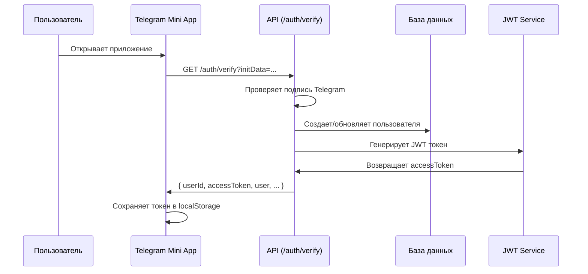
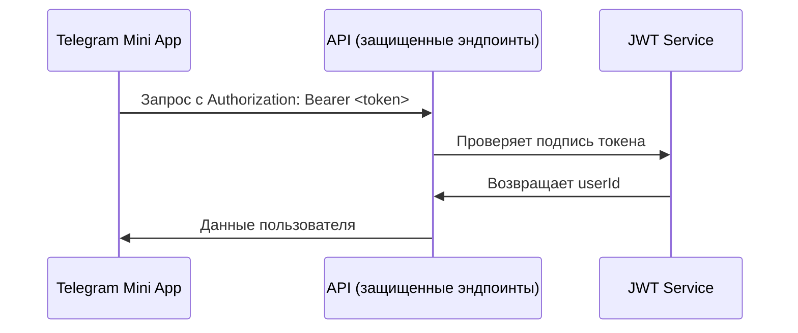

# Интеграция системы авторизации с JWT токенами

## Обзор

Система авторизации была обновлена для работы с JWT токенами вместо прямой передачи Telegram initData в заголовках. Теперь фронтенд использует следующую схему:

1. **Верификация Telegram данных** - получение JWT токена через `/auth/verify`
2. **Использование JWT токенов** - авторизация запросов через `Authorization: Bearer <token>`
3. **Автоматическое управление токенами** - проверка срока действия и обновление

## Основные изменения

### 1. Типы данных

#### Новые типы в `src/types/index.ts`:
```typescript
// JWT Token types
export interface JwtPayload {
  userId: number;
  iat: number;
  exp: number;
}

// Auth state types
export interface AuthState {
  isAuthenticated: boolean;
  accessToken: string | null;
  user: User | null;
  isLoading: boolean;
  error: string | null;
}

// Updated AuthVerifyResponse
export interface AuthVerifyResponse {
  userId: number;
  accessToken: string;
  user: ApiUser;
  isFirstOpen: boolean;
  utm?: Record<string, string>;
  onboardingCompleted: boolean;
  proficiencyLevel?: 'beginner' | 'intermediate' | 'advanced';
}
```

### 2. JWT утилиты

#### В `src/services/auth.ts`:
```typescript
export const jwtUtils = {
  parseToken: (token: string): JwtPayload | null;
  isTokenExpired: (token: string): boolean;
  getStoredToken: (): string | null;
  storeToken: (token: string): void;
  removeToken: (): void;
};
```

### 3. Обновленный API клиент

#### В `src/services/api.ts`:
- **Публичные эндпоинты** (без авторизации):
  - `/auth/verify` - получение JWT токена
  - `/auth/onboarding/status/:userId` - статус онбординга
  - `/leads/bot_start` - команда бота
  - `/content/onboarding` - контент онбординга
  - `/payments/webhook` - webhook платежей

- **Защищенные эндпоинты** (с JWT токеном):
  - `/content/modules` - модули курса
  - `/content/lessons` - уроки
  - `/progress/session` - прогресс пользователя
  - `/profile` - профиль пользователя

### 4. Обновленный User Store

#### В `src/store/user.ts`:
```typescript
interface UserState extends AuthState {
  // Auth actions
  setAuthState: (authState: Partial<AuthState>) => void;
  login: (user: User, accessToken: string) => void;
  logout: () => void;
  checkAuthStatus: () => boolean;
}
```

### 5. Новый сервис прогресса

#### В `src/services/progress.ts`:
```typescript
export const useSaveProgressSession = () => {
  return useMutation({
    mutationFn: async (data: ProgressSessionRequest): Promise<ProgressSessionResponse> => {
      const response = await apiClient.post(API_ENDPOINTS.PROGRESS.SESSION, data);
      return response.data;
    },
  });
};
```

## Процесс авторизации

### 1. Верификация Telegram данных



### 2. Использование JWT токена



## Использование в компонентах

### 1. Проверка авторизации

```typescript
import { useUserStore } from '../store/user';

const MyComponent = () => {
  const { isAuthenticated, user, checkAuthStatus } = useUserStore();
  
  useEffect(() => {
    checkAuthStatus(); // Проверяет токен и обновляет состояние
  }, []);
  
  if (!isAuthenticated) {
    return <div>Необходима авторизация</div>;
  }
  
  return <div>Привет, {user?.firstName}!</div>;
};
```

### 2. Автоматическая авторизация

```typescript
import { useAuth } from '../services/auth';

const LoaderScreen = () => {
  const { authData, isLoading, error, isAuthenticated, user } = useAuth();
  const { login } = useUserStore();
  
  useEffect(() => {
    if (authData && isAuthenticated && user) {
      login(user, authData.accessToken);
    }
  }, [authData, isAuthenticated, user, login]);
  
  // ... остальная логика
};
```

## Обработка ошибок

### 1. Истекший токен

API клиент автоматически:
- Проверяет срок действия токена перед запросом
- Удаляет истекший токен из localStorage
- Логирует предупреждение в консоль

### 2. Неавторизованный доступ (401)

API клиент автоматически:
- Удаляет невалидный токен
- Логирует предупреждение
- Позволяет приложению обработать редирект на авторизацию

## Безопасность

1. **JWT токены** хранятся в localStorage
2. **Автоматическая проверка** срока действия
3. **Очистка токенов** при ошибках авторизации
4. **Валидация подписи** на бэкенде

## Миграция

Все существующие компоненты продолжают работать без изменений. Основные изменения:

1. **API клиент** теперь использует JWT токены вместо Telegram initData
2. **User Store** расширен методами управления авторизацией
3. **AuthService** добавлены утилиты для работы с JWT
4. **Новый сервис** для работы с прогрессом пользователя

## Тестирование

Для тестирования в development режиме:

1. Установите `VITE_API_BASE_URL` в `.env`
2. Убедитесь, что бэкенд возвращает JWT токены
3. Проверьте работу авторизации в Telegram WebApp
4. Проверьте обработку истекших токенов
